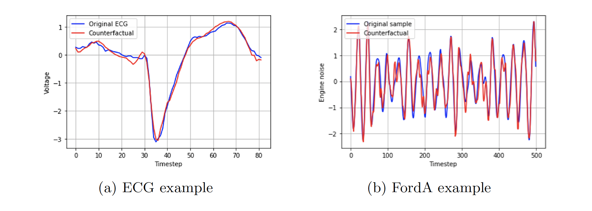

# LatentCF++: Learning Time Series Counterfactuals via Latent Space Representations
In our paper, we adapt the LatentCF approach to time series classification and propose an improved algorithm named LatentCF++ which introduces additional constraints in the counterfactual generation process. We conduct an extensive experiment on a total of 40 datasets from the UCR archive, comparing to current state-of-the-art methods.

If you find this GitHub repo useful in your research work, please consider citing our paper:
```
@inproceedings{wang_learning_2021,
	title = {Learning Time Series Counterfactuals via Latent Space Representations},
	booktitle = {International Conference on Discovery Science},
	author = {Wang, Zhendong and Samsten, Isak, and Mochaourab, Rami, and Papapetrou, Panagiotis},
	year = {2021},
}
```

## Data preparation

We mainly focus on the problem of binary classification tasks with univariate time series data. After filtering, a subset of 40 datasets from the [UCR archive](https://www.cs.ucr.edu/∼eamonn/time_series_data_2018/) is selected, containing various representations from different data sources. For example,TwoLeadECG represents ECG measurements in the medical domain and Wafer exemplifies sensor data in semiconductor  manufacturing. In terms of time series length, it varies from 24 (ItalyPowerDemand) to 2709 timesteps(HandOutlines) in our chosen subset.

For the evaluation in our experiment, we choose to apply a standard 80/20 split for all the datasets. Also, to compensate the imbalanced target classes in specific datasets, we apply a simple upsampling  technique, to resample with duplicates for the  minority target class of training data. The random  seed is fixed to 39 when splitting data into training/testing sets and in the upsampling approach.

## Experiment Setup

In the experiment, we choose to train separate CNN and long short-term memory (LSTM) classification and auto-encoder models, as main components to apply the LatentCF++ frameworks. We opt to use these simpler architectures to highlight the explainable
power of latent space representations.

Thus, we construct two instantiations for both LatentCF and LatentCF++ in our experiment: 1dCNN and LSTM. We show a detailed comparison of different components and hyperparameters for each instantiation in the following table:

$$
\begin{aligned}
\begin{array}{ l l | l l l l } 
\textbf{Method} & \textbf{Instantiation} & \textbf{Auto-encoder} & \textbf{Classifier} & \textbf{Optimization} & \textbf{Threshold} \\ \hline
LatentCF++ & 1dCNN & 1dCNN-AE & 1dCNN-CLF & Adam & 0.5 \\
& LSTM & LSTM-AE & LSTM-CLF & Adam & 0.5 \\
& 1dCNN-C & 1dCNN-C & & Adam & 0.5 \\ \hline  
LatentCF & 1dCNN & 1dCNN-AE & 1dCNN-CLF & Vanilla GD & No \\
& LSTM & LSTM-AE & LSTM-CLF & Vanilla GD & No \\
\end{array}
\end{aligned}
$$

### Implementation Details 

All deep learning models are implemented in Keras. For 1dCNN-AE, LSTM-AE, and 1dCNN-C, we set the training epochs to 50; while for classification models, the training epochs are set to 150 for both 1dCNN-CLF and LSTM-CLF. To reduce overfitting and improve the generalizability of our networks, we employ early stopping during model training. Adam optimizer is employed for all networks with learning rates ranging from 0.0001 and 0.001 for different models. The batch size is set to 32 for all of them.

### Baseline Models

We adopt the first baseline model from the original framework, FGD, which applies the LatentCF method with only a classifier 1dCNN-CLF to perturb samples in the original feature space directly. In addition, we apply two extra baseline methods from local and global time series tweaking approaches - random shapelet forest (RSF) and the k-NN counterfactual method (k-NN).

## Running the comparison

The implementation code of our experiment is at [here](./latentcf-search.py). For executing the experiment for a single dataset (e.g. TwoLeadECG), simply run
```
python notebooks/latentcf-search.py --dataset TwoLeadECG --pos 1 --neg 2 --output twoleadecg-outfile.csv --shallow-cnn 
```

Then for running the experiment for all the datasets from UCR, run the following code:
```
bash run_all_datasets.sh
```

## Results

The results of quantitative analysis are available at this [csv file](./results/all-results.csv). Besides, we have two examples generated from LatentCF++ as below: 

 

Illustrated in blue are the original time series and in red the generated counterfactuals of the opposite class. By inspecting these counterfactuals, domain experts can not only gain improved understandings of the classifier decision boundary, but also can gain insight on how these predictions can be reversed.
